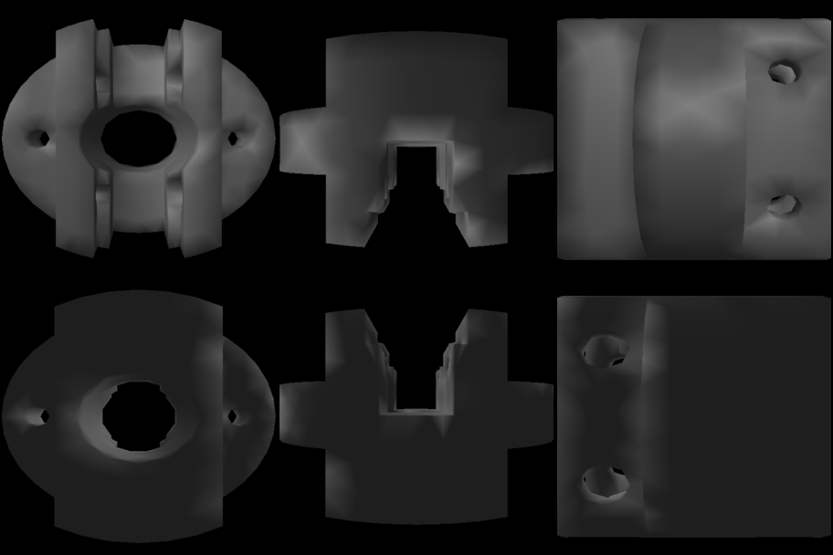

# Description

meshsnapper: A tool to generate a thumbnail overview from a .off mesh

Currently not supported:
* more then 3 vertices per face meshes
* no texture

# Dependencies

* libpng for generating a few single png's from each of the six directions one or
* imagemagick to generate a collection of the images from the different direction in one image

# Flags

* -info (-novis) will print infos about the faces and vertices, the novis flag will supress the visualisation part
* -grab [path]   will place the thumbnail images in path/mesh_name.png

* without flags it will just open the mesh

# Example

The example mesh "socket.off" taken from http://people.sc.fsu.edu/~jburkardt/data/off/off.html
will be generated as:

